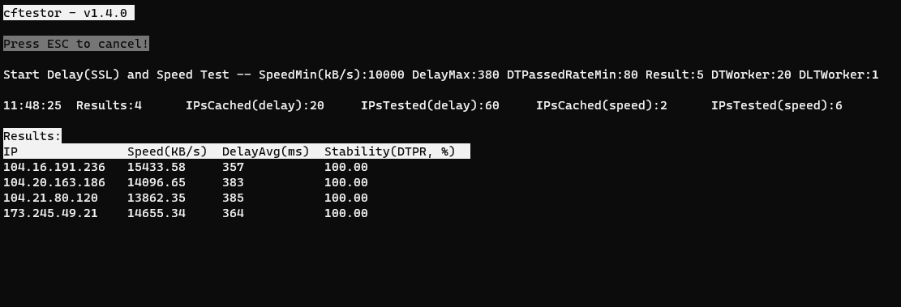

# cftestor:  Cloudflare可用IP测试工具

本项目可以测试Cloudflare IP地址，快速挑选出速度快的地址。
## 特点
1、内置CF的v4和v6地址段，分别通过"-4"和"-6"使用。<br>
2、延时测试采用SSL/TLS握手或HTTPS连接方式非TCP建立连接方式，这样可以剔除专用的IP，初步筛选更加准确。<br>
3、可通过"-S|--dtpr-limit"限制低连接成功率的IP。大致评估网络丢包状况。<br>
4、测试结果可实时滚动显示，而非测试完后才能看到。<br>
5、测试结果可存入文件和sqlite数据库。<br>
6、更多使用方法参见"-h"帮助。<br>

## 下载、编译和运行

### 下载、编译

请在[release](https://github.com/zhfreal/cftestor/releases)
中下载最新的预编译文件或自行编译。
```bash
$ git clone https://github.com/zhfreal/cftestor.git
$ cd cftestor
$ go build .
$ ./cftestor -h

    cftestor v1.5.0
    根据延迟、速度优选CF IP
    https://github.com/zhfreal/cftestor

    参数:
        -s, --ip            string  待测试IP(段)。例如: "-s 1.0.0.1", "-s 1.0.0.1/32",
                                    "-s 1.0.0.1/24"。可重复使用, 传递多个IP或者IP段。
        -i, --in            string  IP(段) 数据文件, 文本文件。 其每一行为一个IP或者IP段。
        -m, --dt-thread     int     延时测试线程数量, 默认20。
        -t, --dt-timeout    int     延时超时时间(ms), 默认1000ms。此值不能小于
                                    "-k|--delay-limit"。当使用"--dt-via-https"时, 应适
                                    当加大此值。
        -c, --dt-count      int     延时测试次数, 默认4。
        -p, --port          int     测速端口, 默认443。当使用SSL握手方式测试延时且不进行下载测
                                    试时, 需要根据此参数测试；其余情况则是使用"--url"提供的参
                                    数进行测试。
            --hostname      string  SSL握手时使用的hostname, 默认"cf.9999876.xyz"。仅当
                                    "--dt-only"且不携带"-dt-via-https"时有效。
            --dt-via-https          使用HTTPS请求相应方式进行延时测试开关。
                                    默认关闭, 即使用SSL握手方式测试延时。
        -n, --dlt-thread    int     下测试线程数, 默认1。
        -d, --dlt-period    int     单次下载测速最长时间(s), 默认10s。
        -b, --dlt-count     int     尝试下载次数, 默认1。
        -u, --url           string  下载测速地址, 默认 "https://cf.9999876.xyz/500mb.dat"。
        -I  --interval      int     测试间隔时间(ms), 默认500ms。
        -k, --delay-limit   int     平均延时上限(ms), 默认600ms。 平均延时超过此值不计入结果集,
                                    不进行下载测试。
        -S, --dtpr-limit    float   延迟测试成功率下限(%), 默认100%。
                                    当低于此值时不计入结果集, 不进行下载测试。默认100, 即不低于
                                    100%。此值低于100%的IP会发生断流或者偶尔无法连接的情况。
        -l, --speed         float   下载平均速度下限(KB/s), 默认2000KB/s。下载平均速度低于此值
                                    时不计入结果集。
        -r, --result        int     测速结果集数量, 默认10。
                                    当符合条件的IP数量超过此值时, 结束测试。但是如果开启
                                    "--test-all", 此值不生效。
            --dt-only               只进行延迟测试, 不进行下载测速开关, 默认关闭。
            --dlt-only              不单独使用延迟测试, 直接使用下载测试, 默认关闭。
        -4, --ipv4                  测试IPv4开关, 表示测试IPv4地址。仅当不携带"-s"和"-i"时有效。
                                    默认打开。与"-6|--ipv6"不能同时使用。
        -6, --ipv6                  测试IPv6开关, 表示测试IPv6地址。仅当不携带"-s"和"-i"时有效。
                                    默认关闭。与"-4|--ipv4"不能同时使用。
        -a  --test-all              测试全部IP开关。默认关闭。
        -w, --store-to-file         是否将测试结果写入文件开关, 默认关闭。
        -o, --result-file   string  输出结果文件。携带此参数将结果输出至本参数对应的文件。
        -e, --store-to-db           是否将结果存入sqlite3数据库开关。默认关闭。
        -f, --db-file       string  sqlite3数据库文件名称。携带此参数将结果输出至本参数对应的数
                                    据库文件。
        -g, --label         string  输出结果文件后缀或者数据库中数据记录的标签, 用于区分测试目标
                                    服务器。默认为"--url"地址的hostname或者"--hostname"。
            --no-tcell      bool    不使用TCell显示。
        -V, --debug                 调试模式。
        -v, --version               打印版本。
    pflag: help requested
$
```
### 运行
```bash
$./cftestor -l 10000

运行画面：
```

结果：
```
$./cftestor -l 10000

All Results:

TestTime IP              Speed(KB/s) DelayAvg(ms) Stability(%)
14:14:02 172.67.163.117  34268.63    429          100.00
14:15:34 172.66.47.81    34131.00    408          100.00
14:14:13 172.67.41.239   31077.84    440          100.00
14:13:16 172.67.93.164   31010.67    389          100.00
14:13:50 172.67.154.195  21430.12    341          100.00
14:14:49 172.67.171.243  21035.27    437          100.00
14:14:24 172.67.217.165  18792.30    342          100.00
14:15:45 172.67.190.13   18171.35    342          100.00
14:15:11 172.67.219.219  18033.72    350          100.00
14:15:22 172.67.69.116   12264.92    347          100.00

```

```
> Speed(KB/s): 下载速度， 单位KB/s
> DelayAvg(ms): TCP同步包发送到SSL握手成功(或者收到http响应时)的平均时间，单位毫秒ms
> Stability(%): 延迟测试（SSL握手或者HTTPS连接）的成功率，大致反映网络的丢包率。
```

## 注意事项
### 1. 自定义测试地址，找到符合自己的最佳IP
默认测试结果只能反映当前位置到CloudFlare服务器的网络情况，不能反映CloudFlare到落地服务器的网络状况。若要测试当前位置经过CloudFlare服务器到落地服务器整条链路的状况，需使用自己的测试地址。 <br>
(1)、自行在落地服务器上创建测试文件，测试文件最好压缩。避免CF或者HTTP容器(nginx/apache/caddy等)使用压缩方式传输数据，而测试速度大于实际速度。<br>
(2)、在CF上通过设置页面规则关闭对此测试文件的缓存，或者在HTTP容器中对此文件进行用户名和密码的访问控制(可按此格式传入: "-u https://<用户名>:<密码>@cf.example.com/test.dat")。<br>
(3)、请注意落地服务器的流量消耗。<br>

### 2. 使用"--dt-via-https"参数测试延时
#### "--dt-timeout"参数增大
此时根据HTTP(s)请求和响应的延迟，其值相当于SSL握手时间加上HTTP Request发送后收到HTTP Response的时间，建议"--dt-timeout"适当增大。
#### ”--dt-thread“参数和"--dlt-thread"参数减小
这种方式下因延迟测试的过程实际上是在做HTTP(s)请求和响应交互，请根据落地服务器的实际性能和CF的限制，降低延迟测试和下载测试的线程数。

### 3. Sqlite数据库存储测试结果
#### 表：CFTD，字段如下：
```
    TestTime      datetime     测试时间                         
    ASN           int          测试所使用本地网络的ASN          
    CITY          text         测试所在地                       
    IP            text         目标CF的IP地址                   
    LABEL         text         落地服务器标识                   
    DTS           text         延迟类型(SSL or HTTPS)
    DTC           int          延迟测试次数                     
    DTPC          int          延迟测试通过次数                     
    DTPR          float        延迟测试成功率                       
    DA            float        平均延迟                     
    DMI           float        最小延迟                     
    DMX           float        最大延迟                     
    DLTC          int          下载尝试次数                     
    DLTPC         int          下载成功次数                     
    DLTPR         float        下载成功率                       
    DLSA          float        下载平均速度(KB/s)               
    DLDS          int          总下载数据大小(byte)
    DLTD          float        总下载时间(秒) 
```
#### 数据库目前存储结果，可自行通过sqlite命令行等方式查询使用结果，方便测试结果的追踪和重复使用。
## 感谢:
> 
> <a href="https://github.com/Spedoske/CloudflareScanner">github.com/Spedoske/CloudflareScanner</a>
> 
> <a href="https://github.com/XIU2/CloudflareSpeedTest">github.com/XIU2/CloudflareSpeedTest</a>
> 
> <a href="https://github.com/gdamore/tcell">github.com/gdamore/tcell</a>
>
>   
